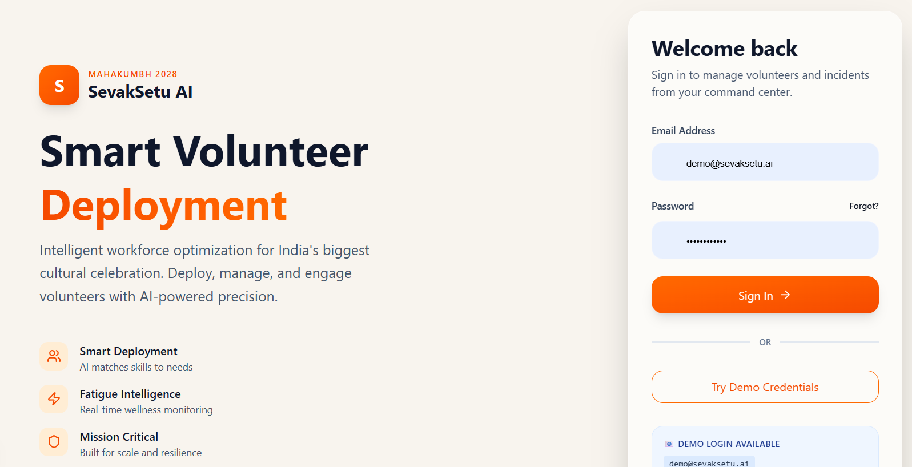
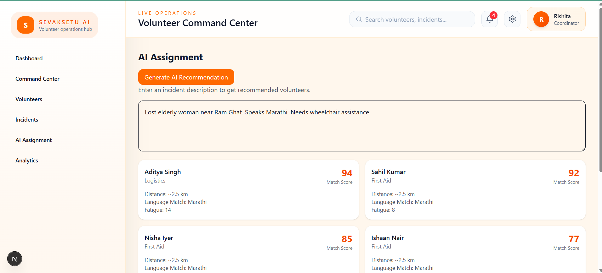

<div align="center">


# SevakSetu AI &nbsp;•&nbsp; सेवकसेतु AI

### *सेवा में समर्पण, तकनीक में शक्ति*
#### *Dedication in Service, Strength in Technology*

**The AI-powered Volunteer Command Center for India's Largest Human Gathering**

*Connecting 50,000+ volunteers. Protecting 200 million pilgrims. Powered by Intelligence.*

<br/>

[](https://sevak-setu.vercel.app)
[](https://react.dev)
[](https://nextjs.org)
[](https://typescriptlang.org)
[](https://tailwindcss.com)
[](https://deepmind.google/technologies/gemini/)
[](https://firebase.google.com)
[](https://vercel.com)
[](LICENSE)
[](https://github.com/Mehtarishita/SevakSetu/stargazers)

<br/>

> 🏆 **Built at ExpertHire × VIT Bhopal Hackathon**

<br/>


</div>

---

## 📌 Table of Contents

- [The Problem](#-the-problem)
- [What is SevakSetu AI?](#-what-is-sevaksetu-ai)
- [Key Features](#-key-features)
- [AI Capabilities](#-ai-capabilities-powered-by-gemini)
- [Screenshots](#-screenshots)
- [Architecture](#️-architecture)
- [Tech Stack](#️-tech-stack)
- [Getting Started](#-getting-started)
- [Roadmap](#-roadmap)
- [Project Impact](#-project-impact--the-mahakumbh-scale)
- [Developer](#-developer)

---

## 🔥 The Problem

### India's largest event has a volunteer coordination crisis.

**Mahakumbh Mela** is the single largest peaceful gathering of humans on Earth. In 2025, over **400 million pilgrims** visited across 45 days. The 2028 edition in Ujjain is expected to exceed that. Behind this sacred spectacle runs a hidden operational challenge that no technology has yet solved.

<br/>

| Challenge | Reality on the Ground |
|---|---|
| 🧑‍🤝‍🧑 Volunteer Scale | 50,000–100,000 volunteers deployed across dozens of ghats and zones |
| 📋 Assignment Method | Mostly manual — spreadsheets, walkie-talkies, and phone calls |
| 🚨 Incident Response | Average response lag of 15–30 minutes due to poor coordination |
| 😴 Volunteer Fatigue | No system to track exhaustion — volunteers work dangerous hours |
| 🗣️ Language Barrier | Pilgrims speak 30+ regional languages; volunteers are rarely matched by language |
| 📍 Zone Imbalance | Some zones are over-staffed; others dangerously under-staffed |
| 📊 Decision Making | Operations commanders lack real-time data to make informed decisions |

<br/>

> *"During the 2013 Allahabad Kumbh Mela stampede, 36 people died. The root cause: communication failure and volunteer misdirection."*

### Why existing solutions fall short

Current event management software is built for concerts and conferences — not for sacred mass gatherings. They lack:

- ❌ AI-driven volunteer-to-incident matching
- ❌ Fatigue-aware deployment logic
- ❌ Multilingual volunteer profiling
- ❌ Real-time incident command dashboards
- ❌ Scale to handle 50,000+ worker profiles simultaneously

**SevakSetu AI was built specifically to solve this.**

---

## 🙏 What is SevakSetu AI?

**SevakSetu AI** (सेवकसेतु = "Bridge of Service") is an intelligent volunteer deployment and incident response command center purpose-built for large-scale cultural and religious events in India.

It acts as a **real-time operational brain** — ingesting volunteer profiles, incident reports, and environmental data, then using Google Gemini AI to recommend the single best volunteer for every situation in seconds.

### Who it serves

| Stakeholder | How SevakSetu Helps |
|---|---|
| 🎛️ Operations Commander | Full event oversight, AI-assisted decisions, live analytics |
| 👮 Zone Supervisor | Manage local volunteers, report incidents, receive AI assignments |
| 🙋 Volunteer | Know your deployment zone, check assignments, update availability |
| 🏛️ Event Authority | Aggregate data, accountability reports, post-event analytics |

### Core Value Proposition

> **Right volunteer. Right place. Right time. Every time.**

SevakSetu AI eliminates the guesswork from volunteer deployment by converting incident context — location, severity, skill requirement, language need — into an instant, confidence-scored volunteer recommendation.

---

## ✨ Key Features

### 👥 Volunteer Management

> *Know your force before you deploy it.*

- **Volunteer Registry** — Centralized directory with full profile management for each volunteer
- **Skill Tracking** — Tag volunteers with specific skills: First Aid, Crowd Control, Language Support, Wheelchair Assistance, Lost-and-Found, etc.
- **Availability Engine** — Real-time availability status (Active / On Break / Off Duty)
- **Fatigue Score System** — Each volunteer carries a dynamic fatigue score updated after every deployment, preventing burnout and dangerous over-assignment
- **Language Profiling** — Volunteers tagged with languages spoken (Hindi, Marathi, Bengali, Tamil, English and more)
- **Search & Smart Filters** — Instantly filter by skill, zone, availability, fatigue, or language

---

### 🚨 Incident Management

> *From report to response in under 60 seconds.*

- **Incident Reporting** — Log any incident with type, location, description, severity, and language requirements
- **Priority Classification** — Incidents ranked as Critical / High / Medium / Low with visual color coding
- **Status Lifecycle** — Open → Assigned → In Progress → Resolved tracking for every incident
- **Incident Dashboard** — Live feed of all active incidents across the event grounds
- **Historical Log** — Full audit trail for post-event analysis and accountability

---

### 🤖 AI Volunteer Assignment Engine

> *Powered by Google Gemini 2.5 Flash.*

The centerpiece of SevakSetu AI. When an incident is reported, the AI engine analyzes every available volunteer against the incident requirements and returns a ranked recommendation with an explanation.

**What the AI considers:**
- 🎯 Skill-to-incident match relevance
- 📍 Zone proximity
- 💤 Current fatigue level
- 🗣️ Language compatibility with the pilgrim in need
- ⏱️ Time since last deployment
- ✅ Real-time availability status

The result is a **confidence-scored recommendation** — not just a name, but a reasoned justification your commanders can trust.

---

### 📊 Analytics & Command Center

> *See everything. Decide faster.*

- **Operational Overview** — Live KPI cards: total volunteers, active incidents, resolved incidents, average response time
- **Volunteer Utilization Chart** — Visual breakdown of deployment rates by zone and shift
- **Incident Heatmap** — Understand which zones are generating the most incidents in real time
- **Fatigue Distribution** — Spot over-deployed volunteers before they become a safety risk
- **Performance Metrics** — Track AI assignment accuracy and response time improvements over time

---

### 🔔 Smart Notification System

> *Alert the right person, not everyone.*

- 🚨 Critical incident alerts with auto-escalation
- ⚠️ Volunteer shortage warnings by zone
- 👥 Crowd density threshold alerts
- ✅ Assignment confirmation notifications
- 📢 Broadcast messaging to volunteer groups

---

### ⚙️ Settings & Profile Management

- Secure user authentication
- Role-based access (Admin / Supervisor / Volunteer)
- Profile customization
- Theme support architecture (light/dark)
- Future-ready personalization pipeline

---

## 🧠 AI Capabilities — Powered by Gemini

SevakSetu AI integrates **Google Gemini 2.5 Flash** through the `@google/genai` SDK via Next.js API routes.

### How It Works

```
┌─────────────────────────────────────────┐
│           INCIDENT REPORTED             │
│  Type: Medical | Zone: Ram Ghat         │
│  "Elderly woman, speaks Marathi,        │
│   needs wheelchair assistance"          │
└──────────────────┬──────────────────────┘
                   │
                   ▼
┌─────────────────────────────────────────┐
│        GEMINI AI ENGINE                 │
│  Input: Incident context +              │
│         All available volunteer         │
│         profiles (skills, fatigue,      │
│         language, zone, availability)   │
└──────────────────┬──────────────────────┘
                   │
                   ▼
┌─────────────────────────────────────────┐
│          AI RECOMMENDATION              │
│  🏆 Kavya Sharma                        │
│  Confidence: 92%                        │
│  Reason:                                │
│   ✅ Speaks Marathi                     │
│   ✅ Trained in Elder Care              │
│   ✅ Fatigue Score: 18/100 (Fresh)      │
│   ✅ Currently in Zone B (nearby)       │
│   ✅ Available for deployment           │
└─────────────────────────────────────────┘
```

### Inputs Analyzed by the AI

| Input Category | Data Points |
|---|---|
| Incident Context | Type, severity, location zone, description, language needed |
| Volunteer Skills | Tagged skills matched against incident type |
| Fatigue State | Numerical fatigue score (0–100 scale) |
| Language Match | Pilgrim's language vs volunteer's spoken languages |
| Availability | Real-time status check |
| Deployment History | Time since last assignment |

### Why Gemini 2.5 Flash?

Gemini Flash was chosen for its **low-latency, high-accuracy reasoning** on structured JSON inputs. In an emergency scenario, sub-second AI response time is not a luxury — it is a life-safety requirement.

---

## 📸 Screenshots

<table>
  <tr>
    <td align="center"><strong>🔐 Login Page</strong></td>
    <td align="center"><strong>📊 Dashboard</strong></td>
  </tr>
  <tr>
    <td></td>
    <td></td>
  </tr>
  <tr>
    <td align="center"><strong>👥 Volunteer Management</strong></td>
    <td align="center"><strong>🚨 Incident Management</strong></td>
  </tr>
  <tr>
    <td></td>
    <td></td>
  </tr>
  <tr>
    <td align="center"><strong>🤖 AI Assignment Engine</strong></td>
    <td align="center"><strong>📈 Analytics</strong></td>
  </tr>
  <tr>
    <td></td>
    <td></td>
  </tr>
</table>

---

## 🏗️ Architecture

SevakSetu AI is a full-stack Next.js 15 application with a clean separation of concerns across UI, logic, services, and data layers.

### System Architecture

```
┌────────────────────────────────────────────────────────────┐
│                     CLIENT (Browser)                       │
│   Next.js 15 App Router  +  React 18  +  Tailwind CSS 4    │
│                                                            │
│  ┌──────────┐ ┌──────────┐ ┌──────────┐ ┌──────────────┐  │
│  │Dashboard │ │Volunteers│ │Incidents │ │ AI Assignment│  │
│  └──────────┘ └──────────┘ └──────────┘ └──────────────┘  │
│                                                            │
│  ┌─────────────────┐   ┌──────────────────────────────┐   │
│  │ Analytics       │   │ Settings & Notifications      │   │
│  └─────────────────┘   └──────────────────────────────┘   │
└─────────────────────┬──────────────────────────────────────┘
                      │ API Calls
                      ▼
┌────────────────────────────────────────────────────────────┐
│                 NEXT.JS API ROUTES (/api)                   │
│                                                            │
│   /api/ai-assign  →  Gemini 2.5 Flash Integration          │
│   /api/volunteers →  Volunteer CRUD operations             │
│   /api/incidents  →  Incident management endpoints         │
└─────────────────────┬──────────────────────────────────────┘
                      │
          ┌───────────┴───────────┐
          ▼                       ▼
┌─────────────────┐    ┌──────────────────────┐
│  Google Gemini  │    │   Firebase / Firestore│
│  2.5 Flash API  │    │   (Data Persistence)  │
└─────────────────┘    └──────────────────────┘
```

### Folder Structure

```
SevakSetu/
│
├── app/                        # Next.js 15 App Router pages
│   ├── dashboard/              # Main command center
│   ├── volunteers/             # Volunteer management module
│   ├── incidents/              # Incident tracking module
│   ├── ai-assignment/          # AI recommendation interface
│   ├── analytics/              # Charts and operational insights
│   ├── api/                    # Server-side API routes
│   └── layout.tsx              # Root layout with navigation
│
├── components/                 # Reusable UI components
│   ├── dashboard/              # Dashboard-specific components
│   ├── volunteers/             # Volunteer cards, forms, tables
│   ├── incidents/              # Incident reporter, status badges
│   └── layout/                 # Sidebar, navbar, wrappers
│
├── services/                   # External API & data service layer
├── hooks/                      # Custom React hooks
├── context/                    # React Context providers
├── types/                      # TypeScript interfaces & types
├── lib/                        # Utility functions & config
├── data/                       # Static seed data & mock datasets
├── public/                     # Static assets
├── scripts/                    # Build & utility scripts
└── Screenshots/                # Product screenshots
```

### Data Flow

```
User Action
   → React Component (UI Layer)
      → Custom Hook (Business Logic)
         → Service Function (Data Layer)
            → API Route (Server Layer)
               → Gemini AI / Firebase (External Services)
                  → Response bubbles back up to UI
```

---

## 🛠️ Tech Stack

| Layer | Technology | Purpose |
|---|---|---|
| **Framework** | Next.js 15 (App Router) | Full-stack React framework with SSR |
| **UI Library** | React 18 | Component-based UI architecture |
| **Language** | TypeScript 5 | Type safety across the entire codebase |
| **Styling** | Tailwind CSS 4 | Utility-first responsive design system |
| **AI Engine** | Google Gemini 2.5 Flash | Volunteer-to-incident matching intelligence |
| **AI SDK** | @google/genai | Official Google GenAI JavaScript SDK |
| **Database** | Firebase Firestore | Real-time NoSQL document database |
| **Auth** | Firebase Authentication | Secure multi-role user management |
| **Deployment** | Vercel | Edge-deployed, globally distributed hosting |
| **Config** | TypeScript ESLint + Prettier | Code quality and consistency tooling |

---

## 🚀 Getting Started

### Prerequisites

- Node.js 18.x or higher
- npm or yarn
- A Google Gemini API key ([get one here](https://aistudio.google.com/app/apikey))
- A Firebase project ([create one here](https://console.firebase.google.com/))

### 1. Clone the Repository

```bash
git clone https://github.com/Mehtarishita/SevakSetu.git
cd SevakSetu
```

### 2. Install Dependencies

```bash
npm install
```

### 3. Configure Environment Variables

Create a `.env.local` file in the root directory:

```env
# Google Gemini AI
GEMINI_API_KEY=your_gemini_api_key_here

# Firebase Configuration
NEXT_PUBLIC_FIREBASE_API_KEY=your_firebase_api_key
NEXT_PUBLIC_FIREBASE_AUTH_DOMAIN=your_project.firebaseapp.com
NEXT_PUBLIC_FIREBASE_PROJECT_ID=your_project_id
NEXT_PUBLIC_FIREBASE_STORAGE_BUCKET=your_project.appspot.com
NEXT_PUBLIC_FIREBASE_MESSAGING_SENDER_ID=your_sender_id
NEXT_PUBLIC_FIREBASE_APP_ID=your_app_id
```

### 4. Run Locally

```bash
npm run dev
```

Open [http://localhost:3000](http://localhost:3000) in your browser.

### 5. Try the Demo

You can also access the live demo without any setup:

| Field | Value |
|---|---|
| **URL** | [sevak-setu.vercel.app](https://sevak-setu.vercel.app) |
| **Email** | demo@sevaksetu.ai |
| **Password** | Volunteer123 |

### 6. Build for Production

```bash
npm run build
npm start
```

### 7. Deploy to Vercel

```bash
# Install Vercel CLI
npm install -g vercel

# Deploy
vercel --prod
```

---

## 🗺️ Roadmap

### ✅ Current — v1.0 (Shipped at Hackathon)

- [x] Volunteer registration & profile management
- [x] Skill and language tagging
- [x] Fatigue score tracking
- [x] Incident reporting and lifecycle management
- [x] Google Gemini 2.5 Flash AI assignment engine
- [x] Confidence-scored recommendations with reasoning
- [x] Analytics dashboard with KPI cards
- [x] Smart notification system
- [x] Responsive design for field tablets and desktop
- [x] Demo environment with seed data
- [x] Vercel deployment

---

### 🔧 Phase 2 — Production Ready

- [ ] Firebase Authentication with role-based access (Admin / Supervisor / Volunteer)
- [ ] Firestore real-time synchronization across all connected clients
- [ ] Live volunteer location tracking via browser geolocation
- [ ] GIS mapping integration (Google Maps / Mapbox) for spatial zone visualization
- [ ] Mobile-first PWA for field volunteers
- [ ] Volunteer self-check-in / check-out system
- [ ] Offline-first capability for low-connectivity zones

---

### 🚀 Phase 3 — Intelligence Layer

- [ ] WhatsApp/SMS notifications via Twilio for field communications
- [ ] Predictive volunteer demand forecasting by zone and time-of-day
- [ ] AI fatigue prediction based on historical deployment patterns
- [ ] Crowd density API integration for real-time zone pressure monitoring
- [ ] Multi-language AI instructions for volunteer briefings
- [ ] Automated emergency escalation tree
- [ ] Voice command interface for hands-free operation

---

### 🌐 Phase 4 — Scale & Ecosystem

- [ ] Multi-event support (deployable for any large public gathering)
- [ ] Volunteer performance scoring and badging system
- [ ] Post-event analytics reports for government and organizers
- [ ] API for third-party integrations (disaster management systems, smart city dashboards)
- [ ] AI model fine-tuning on Kumbh-specific incident data
- [ ] Support for 10+ Indian regional languages in the UI

---

## 🌍 Project Impact — The Mahakumbh Scale

Mahakumbh 2028 in Ujjain is not just an event. It is a civilizational moment.

| Metric | Scale |
|---|---|
| 🧳 Expected Pilgrims | 200–400 million across 45 days |
| 👷 Volunteers Required | 50,000–100,000 across all zones |
| 🕌 Active Zones | 30+ ghats, camps, and entry corridors |
| 🗓️ Event Duration | 45 days of continuous operations |
| 🌐 Languages Spoken | 30+ regional Indian languages |
| 🚑 Emergency Incidents | Thousands per day at peak |

**What SevakSetu AI can change:**

- ⏱️ Reduce average incident response time from 20 minutes → under 2 minutes
- 🧠 Replace manual guesswork with AI-reasoned volunteer matching
- 😴 Prevent volunteer burnout by tracking fatigue in real time
- 🗣️ Ensure pilgrims receive help in their native language
- 📊 Give commanders a live operational picture for smarter decisions

> *A single prevented stampede. A single found child. A single saved life. That is the true measure of this technology.*

---

## 👩‍💻 Developer

<div align="center">

### Rishita Mehta

**B.Tech Computer Science Engineering**
VIT Bhopal University

*Passionate about building technology that matters — AI, design, and impactful systems for real-world problems.*

[](https://github.com/Mehtarishita)

</div>

---

## 🏆 Hackathon

> Built during the **ExpertHire × VIT Bhopal Hackathon**
>
> Theme: *Technology for Social Good*
>
> Domain: *AI-Powered Event Management & Disaster Preparedness*

---

## 📜 License

```
MIT License

Built with 🙏 for Mahakumbh 2028 and all who serve.
Developed for educational, research, innovation, and hackathon purposes.
```

---

<div align="center">

**SevakSetu AI** — *सेवा में समर्पण, तकनीक में शक्ति*

*Dedication in Service. Strength in Technology.*

[](https://sevak-setu.vercel.app)

⭐ If this project inspires you, give it a star — it means the world to an independent developer.

</div>
