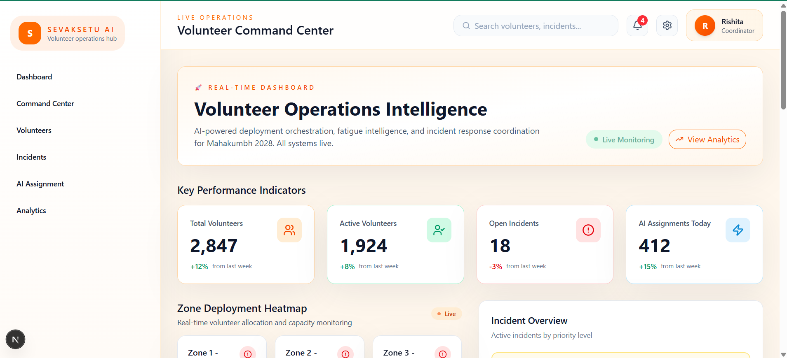
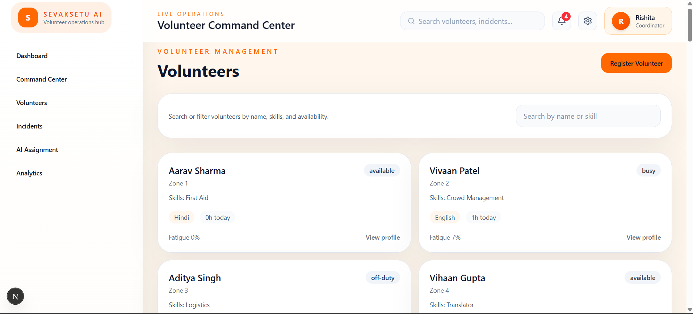
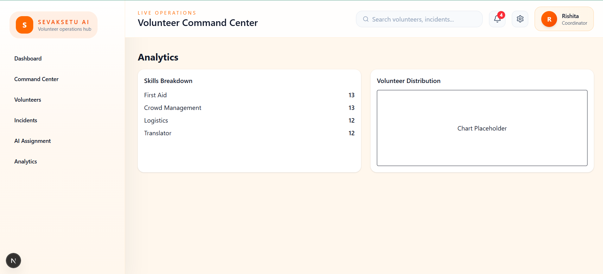

<div align="center">

#   SevakSetu AI • सेवकसेतु AI 
### Connecting Volunteers. Accelerating Response. Empowering Operations.

### Smart Volunteer Deployment & Workforce Optimization

For Large-Scale Events, Festivals, Public Gatherings & Emergency Operations

<br>


</div>


### Dashboard Preview



---


## 🎯 Vision

SevakSetu AI is an intelligent volunteer coordination platform designed to streamline volunteer deployment, incident response, and operational decision-making during large-scale events.

The platform leverages Artificial Intelligence to recommend the most suitable volunteers based on:

- Skills
- Availability
- Fatigue Levels
- Language Compatibility
- Incident Requirements

This enables faster response times, better resource utilization, and improved operational efficiency.


## 🎯 Problem Statement

Managing thousands of volunteers across multiple locations during large public gatherings is challenging.

Organizers often struggle with:

* Manual volunteer assignment
* Delayed incident response
* Uneven workforce distribution
* Volunteer fatigue management
* Lack of intelligent decision support

SevakSetu AI addresses these challenges through an AI-assisted command center.

---

## ✨ Features

### Volunteer Management




### Analytics Dashboard



### 👥 Volunteer Management

* Volunteer registration
* Volunteer directory
* Search and filtering
* Skill tracking
* Availability monitoring
* Fatigue score tracking

### 🚨 Incident Management

* Incident reporting
* Incident categorization
* Priority-based handling
* Status monitoring
* Incident dashboard

### 🤖 AI Volunteer Assignment

Powered by **Google Gemini 2.5 Flash**

The AI evaluates:

* Skill relevance
* Availability
* Fatigue levels
* Language compatibility
* Deployment suitability

and recommends the most appropriate volunteer for an incident.

### 📊 Analytics Dashboard

* Operational overview
* Volunteer statistics
* Incident insights
* Performance monitoring
* Command center analytics

### 🔔 Smart Notifications

* Critical incident alerts
* Volunteer shortage alerts
* Crowd density warnings
* Assignment updates

### ⚙️ Settings & Profile Management

* User profile section
* Theme support architecture
* Future-ready personalization system

---

## 🏗️ Architecture

The project follows a scalable architecture with separate layers for:

```text
app/
components/
services/
hooks/
context/
types/
lib/
api/
```

This structure allows easy migration to production-grade backend services.

---

## 🧠 AI Recommendation Engine

The platform integrates Google Gemini AI to analyze incidents and available volunteers.

Example:

**Incident**

```text
Lost elderly woman near Ram Ghat.
Speaks Marathi.
Needs wheelchair assistance.
```

**AI Output**

```text
Recommended Volunteer: Kavya Sharma

Confidence Score: 92%

Reason:
- Language compatibility
- Volunteer availability
- Suitable skill set
```

---

## 🛠️ Tech Stack

### Frontend

* Next.js 15
* React
* TypeScript
* Tailwind CSS

### Backend

* Next.js API Routes

### AI

* Google Gemini 2.5 Flash
* @google/genai

### Deployment

* Vercel

### Planned Backend

* Firebase Authentication
* Firestore Database
* Real-time Updates

---

## 📁 Project Structure

```bash
app/
├── dashboard/
├── volunteers/
├── incidents/
├── analytics/
├── ai-assignment/
├── api/

components/
├── dashboard/
├── volunteers/
├── incidents/
├── layout/

services/
types/
hooks/
context/
lib/
```

---

## ⚙️ Environment Variables

Create a `.env.local` file:

```env
GEMINI_API_KEY=your_api_key_here
```

---

## 🚀 Installation

Clone the repository:

```bash
git clone https://github.com/Mehtarishita/SevakSetu
```

Move into the project:

```bash
cd sevaksetu-ai
```

Install dependencies:

```bash
npm install
```

Run locally:

```bash
npm run dev
```

Open:

```text
http://localhost:3000
```

---

## 🌟 Future Roadmap

### Phase 2

* Firebase Authentication
* Firestore Integration
* Real-time Volunteer Tracking
* GIS Mapping
* Location Intelligence

### Phase 3

* WhatsApp Notifications
* Predictive Volunteer Deployment
* AI Fatigue Prediction
* Crowd Forecasting
* Emergency Escalation System

---

## 📸 Screenshots

* Login Page
* Dashboard
* Volunteer Management
* Incident Management
* AI Assignment Engine
* Analytics Dashboard

---

## 👩‍💻 Developed By

**Rishita Mehta**

B.Tech Computer Science Engineering
VIT Bhopal University

Passionate about technology, design, AI, innovation, and building impactful solutions for real-world problems.

---

## 📜 License

Developed for educational, research, innovation, and hackathon purposes.
